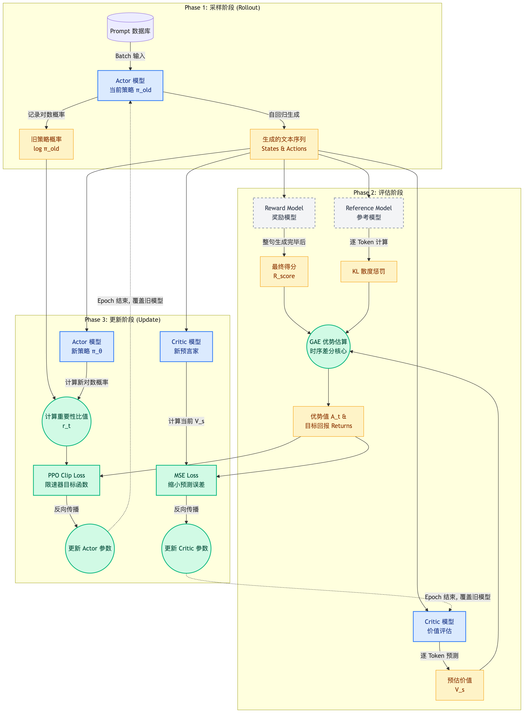
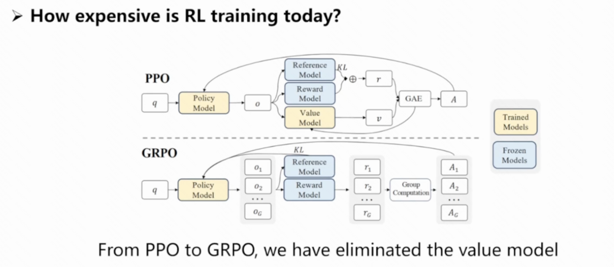

# 大语言模型的强化学习算法

**作者**：chenglitao　｜　**版本**：v2026.04.13　｜　**构建时间**：2026-04-13 16:38

---

# 目录

## [理论基础](#理论基础)

### [核心数学概念解析](#核心数学概念解析)
- [1.1.1 大语言模型的 RL 数学建模](#111-大语言模型的-rl-数学建模)
- [1.1.2 期望回报函数 $J(\pi)$——终极优化目标](#112-期望回报函数-终极优化目标)
- [1.1.3 状态贴现访问频率 $d_\pi$——模型在环境中的长期足迹](#113-状态贴现访问频率-模型在环境中的长期足迹)
- [1.1.4 优势函数 $A(s,a)$——单步动作的超额收益](#114-优势函数-单步动作的超额收益)
- [1.1.5 采样和更新——工程落地的物理映射](#115-采样和更新工程落地的物理映射)
- [1.1.6 重要性采样——用"旧回忆"评估"新未来"](#116-重要性采样用旧回忆评估新未来)
- [1.1.7 KL 散度——负向惩罚项](#117-kl-散度负向惩罚项)

### [性能差异引理PDL](#性能差异引理pdl)
- [1.2 性能差异引理 PDL——串联全局与局部的"核心引擎"](#12-性能差异引理-pdl串联全局与局部的核心引擎)

### [替代目标函数L](#替代目标函数l)
- [1.3 替代目标函数 $L$——向算力妥协的"狸猫换太子"](#13-替代目标函数-向算力妥协的狸猫换太子)

## [强化学习具体算法](#强化学习具体算法)

### [TRPO算法](#trpo算法)
- [2.1 TRPO 算法](#21-trpo-算法)

### [PPO算法](#ppo算法)
- [2.2.1 理论创新——近端截断（Clipping）的启发式哲学](#221-理论创新近端截断clipping的启发式哲学)
- [2.2.2 LLM 语境下的 Actor-Critic 架构落地](#222-llm-语境下的-actor-critic-架构落地)
- [2.2.3 优势估算：GAE 与时序差分（TD）的工程折中](#223-优势估算gae-与时序差分td的工程折中)
- [2.2.4 PPO 的完整流水线：采样、评估与更新](#224-ppo-的完整流水线采样评估与更新)

### [DPO算法](#dpo算法)
- [2.3 DPO 算法](#23-dpo-算法)

### [GRPO算法](#grpo算法)
- [2.4 GRPO 算法](#24-grpo-算法)

### [SAPO_GSPO](#sapo_gspo)
- [2.5 SAPO / GSPO——对齐单位](#25-sapo-gspo对齐单位)

### [学术前沿](#学术前沿)
- [2.6 学术前沿](#26-学术前沿)

## [工程实践](#工程实践)
- [第3章：强化学习的工程实践](#第3章强化学习的工程实践)

---

---

# 理论基础

### 1.1.1 大语言模型的 RL 数学建模

#### 1. 大模型中的 RL 建模

在大模型语境下（如 RLHF），我们将文本生成任务建模为一个马尔可夫决策过程（MDP）：

- **状态 (State $s$)**：当前已生成的 Token 序列（Prompt + 已经生成的上下文）。
- **动作 (Action $a$)**：词表中下一个要预测的 Token。
- **策略 ($\pi$)**：大模型本身，$\pi(a|s)$ 即给定上下文时生成各 Token 的概率分布。
- **奖励 (Reward $r$)**：通常由奖励模型（RM）给出，评价生成的完整句子或片段的质量。

LLM 训练的目标是最大化累积期望回报 $J(\pi)$。

### 1.1.2 期望回报函数 $J(\pi)$——终极优化目标

在明确了状态、动作和奖励的定义后，我们需要一个全局的指标来衡量一个策略（Policy）$\pi$ 到底有多好。在强化学习中，这个终极目标被称为**期望回报函数（Expected Return）**，记为 $J(\pi)$。

对于大语言模型而言，$J(\pi)$ 衡量的是：**如果让当前的 LLM 按照它的概率分布去无限次地回答问题，它平均能拿到多少分。**

为了从数学上精确表达这个概念，学术界通常使用两种等价的视角来描述 $J(\pi)$：轨迹式（时间视角）与分布式（空间视角）。

---

#### 1. 轨迹式（Trajectory-based）：按时间线结算

轨迹（Trajectory），记作 $\tau$，是指模型从接收到 Prompt 开始，一直到生成结束符 `EOS` 为止，所经历的一系列"状态-动作-奖励"的完整序列：$\tau = (s_0, a_0, r_0, s_1, a_1, r_1, \ldots)$。

站在整条时间线的视角，$J(\pi)$ 定义为所有可能轨迹累积奖励的数学期望：

$$
J(\pi) = \mathbb{E}_{\tau \sim \pi} \left[ \sum_{t=0}^{\infty} \gamma^t r(s_t, a_t) \right]
$$

- $\tau \sim \pi$：表示这些轨迹是策略 $\pi$ 和环境互动生成的。
- $\gamma^t$：贴现因子（Discount Factor，$\gamma \in [0, 1)$）。距离当前越远的奖励，权重越低，这保证了无穷级数的收敛性。
- **物理直觉**：这就像是计算一个玩家打通关游戏的平均总得分。我们关心的是"这一局"下来总共赚了多少，而不是某一步的得失。

---

#### 2. 分布式 / 求和式（Distribution-based）：按状态空间结算

虽然轨迹式很直观，但在进行复杂的数学推导（如后续的 PDL）时，按时间步求和会非常繁琐。因此，我们可以通过交换求和顺序，将时间视角的轨迹，转化为空间视角的状态分布：

$$
J(\pi) = \sum_{s} d_\pi(s) \sum_{a} \pi(a|s) R(s, a)
$$

- $d_\pi(s)$：状态贴现访问频率。它代表了在策略 $\pi$ 的长期运行下，模型处于状态 $s$ 的概率权重（即模型有多频繁地遇到某个特定的上下文）。
- $\pi(a|s)$：在状态 $s$ 下，模型选择生成 Token $a$ 的概率。
- $R(s, a)$：在状态 $s$ 生成 Token $a$ 所能获得的即时奖励。
- **物理直觉**：这就像是游乐园管理员计算今天的总营业额。他不看每个游客的游玩路线（轨迹），而是直接统计每个项目（状态 $s$）今天来了多少人（$d_\pi(s)$），以及每个人在这个项目上花了多少钱（$\pi(a|s)R(s,a)$），最后全部加起来。

---

**总结：**

无论是轨迹式还是分布式，它们在数学上是严格等价的。轨迹式更符合我们人类观察大模型生成文本的直觉（一个词一个词地往外蹦），而分布式则通过引入 $d_\pi(s)$，为我们后续拆解性能差异引理（PDL）提供了最重要的数学抓手。

### 1.1.3 状态贴现访问频率 $d_\pi$——模型在环境中的长期足迹

agent 使用策略 $\pi$，在所有时间步上出现状态 $s$ 概率的加权平均，理解为**足迹热力图**。

---

在上一节的分布式公式 $J(\pi) = \sum_s d_\pi(s) \sum_a \pi(a|s)R(s,a)$ 中，我们留下了一个核心变量：$d_\pi(s)$。

在强化学习的数学表达中，它被称为**状态贴现访问频率（Discounted State Visitation Frequency）**，它本质上是一个概率分布。理解它的物理含义，是跨越理论门槛、读懂后续一切算法（尤其是 PDL 和 PPO）的关键。

#### 1. 数学定义：时间的加权平均

它的严谨数学定义如下：

$$
d_\pi(s) = (1 - \gamma) \sum_{t=0}^{\infty} \gamma^t P(s_t = s | \pi)
$$

不要被这个公式吓倒，我们可以把它拆解开来：

- $P(s_t = s|\pi)$：表示在策略 $\pi$ 的控制下，模型在第 $t$ 步时，恰好处于状态 $s$ 的概率。
- $\gamma^t$：时间衰减权重。强化学习关注的是"贴现回报"，距离现在越远的状态，其重要性呈指数级衰减。
- $(1 - \gamma)$：这是一个归一化常数。乘以它之后，所有状态的 $d_\pi(s)$ 加起来刚好等于 1，从而构成一个合乎数学定义的合法概率分布。

**一句话总结**：$d_\pi(s)$ 就是策略 $\pi$ 在所有时间步上访问状态 $s$ 的概率的"加权平均"。

---

#### 2. 物理直觉：环境中的"足迹热力图"

为了建立直觉，想象大模型（Agent）在一个由所有可能文本构成的巨大的迷宫（状态空间）中行走。

- **策略 $\pi$**：就是大模型的"导航习惯"。
- **$d_\pi(s)$**：就是这个大模型在这个迷宫里走很久之后，在地图上留下的**足迹热力图**。

不同的策略，会产生截然不同的热力图。例如，面对同一个 Prompt："请解释量子力学"：

- **策略 A（闲聊模型）**：喜欢用大白话。它的 $d_{\pi_A}(s)$ 热力图会集中在包含"通俗"、"比喻"等词汇的状态区域。
- **策略 B（科研模型）**：喜欢推导公式。它的 $d_{\pi_B}(s)$ 热力图会集中在包含"薛定谔方程"、"希尔伯特空间"等深奥术语的状态区域。而它在"大白话"区域的访问概率几乎为 0。

---

假设我们有两个模型（策略）：

- **策略 $\pi$（旧模型）**：只会写简单的中文短句。
- **策略 $\pi'$（新模型）**：学会了写复杂的 Python 代码。

此时 $d_{\pi'}$ 和 $d_\pi$ 的区别巨大：

- $d_\pi(s)$（**旧分布**）：在这个分布里，包含 `def`、`class`、`import` 这些词的状态 $s$ 概率几乎为 0。模型根本不会走到这种状态里去。
- $d_{\pi'}(s)$（**新分布**）：在这个分布里，包含代码逻辑的状态 $s$ 概率很高。

---

#### 3. 大模型语境下的致命痛点（分布偏移）

为什么这个分布在算法设计中如此重要，又如此让人头疼？

当我们在优化模型时，我们试图用**旧策略 $\pi_{old}$** 收集到的数据，来评估并改进**新策略 $\pi_{new}$**。

- 评估新策略的好坏，理应在新策略自己的热力图 $d_{\pi_{new}}(s)$ 下进行评价。
- 但我们在训练的当下，手里只有旧模型跑出来的数据，也就是只知道旧热力图 $d_{\pi_{old}}(s)$。

这就引出了强化学习中最经典的**分布偏移（Distribution Shift）**问题：如果新模型"步子迈得太大"，它想去探索的代码区域，旧模型从来没去过（$d_{\pi_{old}}(s) \approx 0$），这时候梯度的计算就会瞬间崩溃。

**承上启下：**
正是因为 $d_\pi(s)$ 深刻地绑定了"策略本身的轨迹特征"，后续的**性能差异引理（PDL）**才需要巧妙地通过数学变换，将新旧策略的性能差异，完全建立在 $d_\pi(s)$ 这个分布的基础之上。而再往后的 **PPO 算法**，其核心的 Clip 操作，本质上也是为了强行将新策略"锁死"在旧策略的热力图附近，防止这种分布偏移。

---

#### 4. 总结：在大模型中的 $d_\pi(s)$

在大模型语境下，$d_\pi(s)$ 就是："**给定这个模型的所有权重参数，如果我们让它对全天下所有的 Prompt 进行生成，它所产生的所有文本片段（Context）的分布集合。**"

- 如果模型变了（策略更新了），它生成的文本风格、逻辑深度、用词习惯全变了。
- 这就意味着它在"所有可能的文本宇宙"里，点亮的区域发生了物理上的位移。
- RL 的难点就在于：**我们正试图用站在 A 区域收集到的经验，去指导模型如何探索 B 区域。**

### 1.1.4 优势函数 $A(s,a)$——单步动作的超额收益

是动作价值函数和状态价值函数的差值，标识在给定 $s$ 和 $a$ 的情况下，某选择比平均表现要好多少。

$V(s)$ 状态价值函数，$Q(s,a)$ 动作价值函数。

---

#### 1. $V(s)$：状态价值函数（State Value Function）

- **含义**："处于当前这种处境，如果不乱来，平均能拿多少分？"
- **定义**：$V(s) = \mathbb{E}[R_t | s_t = s]$。即站在状态 $s$，按照当前的策略 $\pi$ 一直走下去，预期能获得的累计回报。
- **LLM 例子**：
  - Prompt（状态 $s$）："中国的首都是____"
  - 此时模型觉得这个句子很有希望写好，因为它知道答案。
  - $V(s)$ 很高（比如 10 分），代表"平均期望得分很高"。

#### 2. $Q(s,a)$：动作价值函数（Action Value Function）

- **含义**："在当前处境下，我如果执意选了动作 $a$，然后再按规矩走下去，能拿多少分？"
- **定义**：$Q(s,a) = \mathbb{E}[R_t | s_t = s, a_t = a]$。
- **LLM 例子**：
  - 状态 $s$："中国的首都是____"
  - 动作 $a_1$："北京"。这是一个正确的词。选了它，后面句子通顺，得分高。$Q(s, \text{"北京"}) = 12$ 分。
  - 动作 $a_2$："东京"。这是一个错误的词。选了它，后面就圆不回来了，得分低。$Q(s, \text{"东京"}) = 2$ 分。

#### 3. $A(s,a)$：优势函数（Advantage Function）

- **含义**："这个动作相对于平均水平的'惊喜'程度。"
- **公式**：$A(s,a) = Q(s,a) - V(s)$

我们把上面的数字代进去：

1. 对于"北京"：

$$A = 12(\text{Q}) - 10(\text{V}) = +2$$

- 解读：比平均水平（期望）要好，这是一个正优势动作，应该鼓励（提高它的概率）。

2. 对于"东京"：

$$A = 2(\text{Q}) - 10(\text{V}) = -8$$

- 解读：比平均水平差很多，这是一个负优势动作，应该惩罚（降低它的概率）。

- **效果**：$A$ 就像一个**去中心化（Zero-centered）**的指标，清楚地告诉模型：**别管大环境好不好，我只关心你这一步走得是对还是错。**

---

#### 5. 你觉得眼熟的原因：TD Error

你觉得 $Q - V$ 眼熟，很可能是因为在实际计算中，我们没法直接算出 $Q$（那需要遍历未来），所以我们常用 **TD Error（时序差分误差）**来近似它：

$$
A(s,a) \approx \underbrace{r + \gamma V(s') - V(s)}_{\approx Q(s,a)}
$$

- $r$：这一步拿到的即时奖励。
- $V(s')$：下一步状态的价值（由 Critic 模型预测）。
- $V(s)$：当前状态的价值（由 Critic 模型预测）。

这个 $r + \gamma V(s') - V(s)$ 就是大名鼎鼎的 **TD Error ($\delta$)**。在大模型训练（如 PPO）中，Critic 网络的 Loss 就是为了让 $V(s)$ 尽可能接近 $r + \gamma V(s')$。

### 1.1.5 采样和更新——工程落地的物理映射

当我们把 $J(\pi)$、分布 $d_\pi(s)$ 和优势函数 $A(s,a)$ 组合在一起时，理论公式是极其优雅的。但在大语言模型的工程实战中，这个优雅的公式必须被生生劈成两个在物理机器上截然不同的阶段：**采样（Sampling）与更新（Updating）**。

这种分离，正是理论与算力现实妥协的产物：

---

#### 1. 采样阶段（Rollout / Inference）

- **对应公式**：寻找外层的状态分布 $s \sim d_\pi(s)$。
- **工程动作**：我们将大模型切换到 `eval()` 推理模式。给定一批 Prompt，让模型自回归地一个词一个词往外吐，生成完整的轨迹（回答）。
- **算力特征**：这是整个 RL 流程中最耗时的"内存带宽受限"阶段。为了解决长文本生成的低效，工程上往往需要引入 vLLM 等极致的推理引擎架构。

#### 2. 更新阶段（Optimization / Training）

- **对应公式**：计算内层的 $\pi(a|s)A(s,a)$ 并最大化目标。
- **工程动作**：将模型切换回 `train()` 模式。利用刚才采样收集到的"状态-动作-奖励"数据，构建 Loss 函数，执行反向传播（Backpropagation）计算梯度，并通过 Adam 等优化器更新网络权重 $\theta$。
- **算力特征**：这是"算力密集型"阶段，高度依赖 FlashAttention 等矩阵乘法加速技术。

---

**现在，我们把目光聚焦到你提到的期望回报函数的分布式表达式：**

$$J(\pi) = \sum_s d_\pi(s) \sum_a \pi(a|s) R(s,a)$$

或者在 PDL 中研究优势函数时的形式：

$$J(\pi') - J(\pi) = \sum_s d_{\pi'}(s) \sum_a \pi'(a|s) A^\pi(s,a)$$

在这个双重求和的式子里，**外层的 $\sum_s$ 指导了"采样"，内层的 $\sum_a$ 指导了"更新"**。

---

#### A. 外层：$d_\pi(s)$ 告诉你"去哪里采样"

数学上，$\sum_s d_\pi(s)$ 要求我们遍历宇宙中所有的状态 $s$，并乘以它们出现的概率。但在真实的 LLM 中，状态空间（所有可能的文本组合）是无限大的，算力根本不可能遍历。

**算法设计的指导：蒙特卡洛近似（Monte Carlo Approximation）**

既然不能遍历，算法设计者就会说："那我们就让当前的策略 $\pi$ 自己去环境里跑几次吧！"只要模型自己生成的文本足够多，它跑到某个状态 $s$ 的**次数占比**，自然就等于**概率 $d_\pi(s)$**。

- **工程体现**：这就是为什么在 PPO 或 GRPO 中，我们必须用**当前正在训练的这个模型**去对 Prompt 进行生成（即 On-policy 采样）。如果你用一个上个月训好的旧模型去生成数据，那你采到的就是 $d_{\pi_{old}}(s)$，公式就不成立了，训练就会出现偏差。

#### B. 内层：$\pi(a|s)R(s,a)$ 告诉你"怎么做更新"

一旦无人机飞到了某个具体的地点（即我们通过采样得到了一个具体的上下文 $s$），接下来的任务就是评价和改变。

**算法设计的指导：梯度上升（Gradient Ascent）**

内层的 $\sum_a \pi(a|s)$ 要求我们在状态 $s$ 下，综合评估所有可能的动作 $a$。在工程中，我们同样无法遍历字典里的几万个 Token，所以我们只看刚才采样时实际选的那个动作 $a$。

- 如果 $R(s,a)$ 或 $A(s,a)$ 是正的（好动作）：算法就知道，需要在计算 Loss 时，推动参数更新，让 $\pi(a|s)$ 的概率**变大**。
- 如果 $R(s,a)$ 或 $A(s,a)$ 是负的（坏动作）：算法就知道，需要调整参数，让 $\pi(a|s)$ 的概率**变小**。

---

**一句话总结**：采样是"去考场做题并拿回评分"，更新是"对着错题本修改大脑的神经网络"。在 RLHF 中，绝大部分的时间和显存瓶颈，都卡在如何高效地让这两个阶段在 GPU 集群上交替流转。

### 1.1.6 重要性采样——用"旧回忆"评估"新未来"

在"采样"与"更新"的交替中，一个严峻的工程矛盾出现了：**采样太贵了**。

如果按照最严格的 On-policy（同策略）要求，新模型 $\pi_{new}$ 每更新哪怕极小的一步权重，它就变成了另一个模型。理论上，我们必须把之前采集的所有数据全扔掉，让这个新模型重新去环境里采样。这对于百亿参数的 LLM 来说，算力成本是不可接受的。

为了解决"数据复用"的问题，强化学习引入了统计学中的经典魔法：**重要性采样（Importance Sampling）**。

---

#### 数学戏法

重要性采样的核心是在期望公式中强行塞入一个比值：

$$
\mathbb{E}_{x \sim P_{new}}[f(x)] = \mathbb{E}_{x \sim P_{old}} \left[ \frac{P_{new}(x)}{P_{old}(x)} f(x) \right]
$$

---

#### 物理直觉：权重的放大与缩小

假设我们想评估新模型 $\pi_\theta$ 的性能，但手里只有旧模型 $\pi_{old}$ 昨天生成的旧数据。

- 如果旧模型生成 Token $a$ 的概率是 10%，而新模型生成它的概率变成了 20%。
- 我们不需要让新模型重新去生成一遍。我们只需要把旧模型在这个动作上获得的优势 $A(s,a)$，乘以一个权重 $r_t(\theta) = \frac{20\%}{10\%} = 2.0$。

这个 $r_t(\theta) = \frac{\pi_\theta(a|s)}{\pi_{old}(a|s)}$ 被称为**重要性权重（Importance Weight）**。

- **概率变大**：如果新模型更倾向于某个好动作，其对应的优势就会被放大，梯度也随之增强。
- **概率变小**：如果新模型不再倾向某个动作，它的优势就会被缩小。

---

#### 致命隐患与承下启下

重要性采样虽然完美解决了数据复用的工程痛点，让我们可以对同一个 Batch 的采样数据进行多个 Epoch 的参数更新，但它极其脆弱。**如果新旧策略差异过大，导致分母 $\pi_{old}$ 极小，这个比值就会瞬间爆炸趋向无穷大，导致梯度彻底失控。**

为了镇压重要性采样带来的方差爆炸，我们必须引入一道终极防线——这就顺理成章地引出了下一节的 **1.1.7 KL 散度** 以及随后 PPO 算法中的 **Clip（截断）机制**。

### 1.1.7 KL 散度——负向惩罚项

在 1.1.6 节中我们看到，重要性采样比值 $r_t(\theta) = \frac{\pi_\theta(a|s)}{\pi_{old}(a|s)}$ 是大模型 RL 能够高效迭代的核心。但是，数学的馈赠往往暗中标好了价格：一旦新策略 $\pi_\theta$ 觉得某个动作很好，不顾一切地把它的概率推高，而旧策略 $\pi_{old}$ 认为这个动作的概率极低，这个比值就会瞬间暴增到几十甚至上百。

这种情况在工程上表现为梯度爆炸，在宏观现象上则被称为**"奖励黑客（Reward Hacking）"**——模型为了迎合奖励函数的喜好（比如只要输出长句就给高分），彻底抛弃了正常人类语言的语法和逻辑，变成了一台只会"刷分"的乱码生成器。

为了镇压这种异变，我们需要一种工具来严格限制新旧策略之间的"距离"。这就是 **KL 散度（Kullback-Leibler Divergence）**。

---

#### 1. 数学定义：不对称的距离

KL 散度用于衡量两个概率分布 $P$ 和 $Q$ 之间的差异，其离散形式定义为：

$$
D_{KL}(P \| Q) = \sum_x P(x) \log \frac{P(x)}{Q(x)}
$$

在大语言模型的 RLHF 中，我们通常衡量的是当前策略 $\pi_\theta$ 与参考策略 $\pi_{ref}$（通常是 SFT 阶段微调好的初始模型）在各个动作上的分布差异：

$$
D_{KL}(\pi_\theta(\cdot|s) \| \pi_{ref}(\cdot|s))
$$

---

#### 2. 物理直觉：防止"忘本"的惩罚项

如果把优化大模型比作放风筝：

- **奖励函数 $R$** 是风，不断把风筝（新策略）往高分的方向吹。
- **KL 散度** 就是你手里的那根风筝线，它的另一头死死钉在地面（SFT 参考模型）上。

不管新模型为了拿高分跑得有多远，KL 散度都会无情地计算出它偏离"正常人说人话（SFT 分布）"的程度。一旦偏离过大，$\log \frac{\pi_\theta}{\pi_{ref}}$ 就会产生一个巨大的正值。

在实际的损失函数设计中，我们通常把 KL 散度作为一个**负向惩罚项**扣除掉：

$$
\text{最终奖励} = R(s,a) - \beta \cdot D_{KL}(\pi_\theta \| \pi_{ref})
$$

**一句话总结**：KL 散度是强化学习中的"保守主义者"。它通过数学上的对数放大效应，强制要求模型在追求高分的道路上"小步快跑"，绝不能为了短期的巨额 Reward 而丧失掉预训练赋予的语言连贯性。

## 1.2 性能差异引理 PDL——串联全局与局部的"核心引擎"

在优化大模型时，我们面临一个最朴素的问题：**我怎么证明新模型 $\pi_{new}$ 一定比旧模型 $\pi_{old}$ 强？强了多少？**

按照定义，我们需要计算两者的全局期望回报之差：$J(\pi_{new}) - J(\pi_{old})$。但 $J(\pi)$ 是一个宏观的、计算整条轨迹收益的复杂函数。如果在每更新一次参数后，都要把新模型拉出来跑几万遍全流程测试，算力成本将是毁灭性的。

**性能差异引理（PDL）** 像变魔术一样解决了这个问题。它通过严谨的数学推导（裂项相消法），给出了一个极其优雅的等式：

$$
J(\pi_{new}) - J(\pi_{old}) = \sum_s d_{\pi_{new}}(s) \sum_a \pi_{new}(a|s) A^{\pi_{old}}(s,a)
$$

如果写成期望的形式，就是：

$$
J(\pi_{new}) = J(\pi_{old}) + \mathbb{E}_{s \sim d_{\pi_{new}}, a \sim \pi_{new}} \left[ A^{\pi_{old}}(s,a) \right]
$$

---

#### 1. 物理直觉：登山者的"局部-全局"视角

为了理解这个公式的伟大之处，我们想象大模型是在爬一座名为 $J(\pi)$ 的高山。

- $J(\pi_{old})$：是我们现在所处的海拔高度（旧基准）。
- $J(\pi_{new})$：是我们换了一条新路线后，最终到达的海拔高度。
- $A^{\pi_{old}}(s,a)$：是我们在这条新路线上的每一步，相对于原来那条路的"海拔提升"（优势）。

PDL 定理在数学上确立了一个极其珍贵的等价性：

> **你最终到达的绝对高度 = 你的起点高度 + 你这一路上每一步"相对提升高度"的总和。**

这意味着，工程师们**不需要再盯着那个虚无缥缈的全局宏观目标 $J(\pi)$ 看了**。只要我们能保证模型在每一个具体的状态 $s$ 下，做出的动作 $a$ 其优势函数 $A(s,a)$ 是正的（即每一步都在往高处走），那么 PDL 就在数学上 100% 担保：你的总分 $J(\pi_{new})$ 一定会增加！

---

#### 2. 公式的"三明治"结构拆解

让我们像剥洋葱一样，从工程的视角剖析等式右边这个期望 $\mathbb{E}$ 里的三层结构：

1. **去哪儿评估？** （$s \sim d_{\pi_{new}}$）
   这是**权重层**。它要求我们必须在**新策略自己喜欢去的地方**（即新策略的驻留热力图 $d_{\pi_{new}}$）来评估它的优势，而不是拿旧模型的"闲聊题"来考它。

2. **怎么做选择？** （$a \sim \pi_{new}$）
   这是**动作层**。在某个具体的题目 $s$ 下，新模型打算给出什么回答？

3. **这事儿值不值？** （$A^{\pi_{old}}(s,a)$）
   这是**标尺层**。注意，这里用的是**旧模型的尺子**！我们用旧模型计算出的优势函数，去精确衡量新模型的每一个选择是赚了还是赔了。

---

#### 3. 致命的工程悖论（The Catch-22）

当你看到这里，准备撸起袖子写代码时，你会立刻撞上一堵叹息之墙——一个无解的悖论。

看回 PDL 的公式：我们需要计算 $\mathbb{E}_{s \sim d_{\pi_{new}}}$。

- 为了计算这个式子来更新参数，我们需要知道 $d_{\pi_{new}}(s)$。
- 但 $d_{\pi_{new}}(s)$ 是新模型跑出来的热力图。
- **在新模型训练好之前，我怎么可能知道它会跑出什么热力图？！**

这就好比：我想买一双合脚的鞋（更新参数）去跑步，但测量脚的尺寸必须在跑步之后才能进行。我们在第一章苦心孤诣推导出的完美数学定理，在算力现实面前变成了一个无法直接求解的"死循环"。

**承下启下：**
面对这个死局，我们只有一条路可走：**妥协与近似**。既然 $d_{\pi_{new}}$ 算不出来，我们能不能"偷梁换柱"，直接用手里现成的旧数据 $d_{\pi_{old}}$ 来代替它？这种数学上的"僭越"，就直接催生了我们在下一节即将登场的真正用于写代码求解的目标：**1.3 替代目标函数 $L$**。

## 1.3 替代目标函数 $L$——向算力妥协的"狸猫换太子"

在 1.2 节中，性能差异引理（PDL）把强化学习推向了理论的最高潮：只要在**新模型的热力图 $d_{\pi_{new}}(s)$ 上**，保证每一步的动作优势 $A(s,a) > 0$，宏观总收益 $J(\pi)$ 就必定单调递增。

但我们立刻撞上了那个算力死局：**在新模型训练出来之前，我们根本无法获得 $d_{\pi_{new}}(s)$**。

面对这个理论上的"乌托邦"，工程师们做出了一个极其大胆且粗暴的决定：**既然拿不到新的，那就直接用旧的！** 我们强行把公式里那个未知的 $d_{\pi_{new}}(s)$，替换成我们手里现成的数据分布 $d_{\pi_{old}}(s)$。

经过这种"狸猫换太子"的替换，配合我们在 1.1.6 节提到的**重要性采样机制**，我们终于构造出了一个真正在代码里可以被 `backward()` 求导的**替代目标函数（Surrogate Objective Function）**，记作 $L(\pi)$：

$$
L(\pi) = J(\pi_{old}) + \sum_s d_{\pi_{old}}(s) \sum_a \pi(a|s) A^{\pi_{old}}(s,a)
$$

如果在工程实现中写成我们熟悉的期望形式，并剥离掉常数项 $J(\pi_{old})$，它就是：

$$
L^{surr}(\pi) = \mathbb{E}_{s \sim d_{\pi_{old}}, a \sim \pi} \left[ \frac{\pi(a|s)}{\pi_{old}(a|s)} A^{\pi_{old}}(s,a) \right]
$$

---

#### 1. 数学上的合法性：为什么可以这么换？

随意替换概率分布，难道不怕模型被带进沟里吗？这里隐藏着强化学习中最具物理美感的一个数学性质：**一阶导数等价（First-order Derivative Equivalence）**。

经过严谨的数学求导可以证明，在 $\pi = \pi_{old}$ 这个起点上，真实的期望回报 $J$ 和我们的替代赝品 $L$ 具备两个神器的特征：

1. **值相等**：$L(\pi_{old}) = J(\pi_{old})$。
2. **梯度（切线方向）完全一致**：$\nabla_\theta L(\pi_\theta)|_{\theta_{old}} = \nabla_\theta J(\pi_\theta)|_{\theta_{old}}$。

**物理直觉：**
想象你要爬一座笼罩在迷雾中的大山 $J$。虽然你看不清整座山的地形（算不出 $d_{\pi_{new}}$），但替代目标函数 $L$ 就是你脚下正踩着的一块极其平整的木板。这块木板目前的倾斜角度（梯度），和这座山此时此地的真实坡度**一模一样**。

因此，只要你顺着 $L$ 的指引迈出第一步，这第一步绝对是正确的，它 100% 指向山顶。

---

#### 2. 对后续算法的指导意义：打开潘多拉魔盒

一阶导数等价解决了一步之内的问题，但也直接引出了大模型 RL 最核心的危机：**木板终究不是山**。

$L$ 只是 $J$ 在起点处的一个局部近似（相当于一阶泰勒展开）。当你顺着 $L$ 往前走了一段距离后（新模型发生了变化），$L$ 和真实的 $J$ 就会分道扬镳。如果新旧分布差异过大（发生了分布偏移），你继续无脑最大化 $L$，就会一脚踩空掉下悬崖。

**承下启下：**
第一章的全部数学推导到此正式终结。我们手里现在有了一个可以写进代码的优化目标 $L$，但也悬着一把"不能走太远"的达摩克利斯之剑。

面对这个"必须优化 $L$，但又必须限制步伐"的终极命题，学术界和工业界给出了截然不同的解法，这便直接开启了我们第二章的壮阔史诗：

- **数学家**选择了添加硬约束，诞生了 **TRPO**。
- **工程师**选择了直接暴力截断，诞生了 **PPO**。
- **极客们**选择了干掉评价模型直接内卷，诞生了 **GRPO**。

接下来，就让我们进入第二章，看看这些大名鼎鼎的算法是如何在代码层面花式求解这个 $L$ 的。

---

**此外，这个公式具有极其重要的工程指导意义：**

- **TRPO (Trust Region Policy Optimization)** 的思路是：既然误差受 KL 散度控制，那我就把 KL 散度作为一个强制约束（Constraint），保证 $\pi'$ 不走出这个"本地"范围。
- **PPO (Proximal Policy Optimization)** 的思路更简单粗暴：我直接在 Surrogate Objective 里加一个 `clip` 操作，或者加一个 KL 惩罚项，强制不让新旧策略的比例（Ratio）跑得太远。

---

# 强化学习具体算法

## 2.1 TRPO 算法

**Trust Region Policy Optimization**

TRPO（2015年由 John Schulman 提出）的核心目标就是：利用上述 KL 散度相关的误差控制，在有约束的条件下最大化替代目标函数。

---

#### (2) 数学表达

TRPO 将策略更新变成了一个**带约束的优化问题**：

$$\max_\theta \ L_{\theta_{old}}(\theta)$$

$$\text{subject to} \ \bar{D}_{KL}(\theta_{old}, \theta) \leq \delta$$

- **目标**：最大化替代收益（即我们之前说的 $ratio \cdot advantage$）。
- **约束**：新旧策略的平均 KL 散度不能超过 $\delta$。

---

#### (3) 如何求解？（TRPO 的硬核之处）

由于大模型/神经网络参数量巨大，直接解这个带约束的问题很难。TRPO 采用了以下硬核数学手段：

1. **一阶近似目标函数**：对 $L$ 进行泰勒展开（即梯度 $\nabla L$）。
2. **二阶近似约束项**：对 KL 散度进行二阶泰勒展开，得到**海森矩阵（Hessian Matrix）**，在 KL 散度背景下这个矩阵被称为**费舍尔信息矩阵（Fisher Information Matrix, FIM）**。
3. **共轭梯度法（Conjugate Gradient）**：为了避免直接计算巨大的海森矩阵逆矩阵，TRPO 使用 CG 算法来近似求解更新步长。

---

#### 4. TRPO 与大模型（LLM）的关系

虽然现在的 LLM 训练主流用的是 PPO，但理解 TRPO 是理解一切"对齐算法"的基础：

- **为什么 LLM 不直接用 TRPO？** TRPO 需要计算二阶导数信息（费舍尔信息矩阵），对于拥有千亿参数的大模型来说，计算和存储这个矩阵的成本是天文数字。
- **PPO 是如何改进的？** PPO（Proximal Policy Optimization）可以看作是 TRPO 的"平替版"。它不再折腾复杂的二阶导数和硬性约束，而是通过 **Clipped Surrogate Objective（截断替代目标）** 或 **KL Penalty（KL 惩罚项）**，用一阶梯度的方法实现了和 TRPO 类似的"置信域"效果。

---

#### 3. 从 TRPO 到 PPO：从"硬约束"到"软截断"

既然你已经理解了 TRPO，你会发现它虽然完美，但有一个巨大的工程痛点：**解这个带 KL 约束的方程太慢了**。每一轮更新都要计算费舍尔信息矩阵（Fisher Information Matrix）的逆，这在大模型训练中是不可接受的。

于是，**PPO (Proximal Policy Optimization)** 出现了，它继承了 TRPO 的灵魂（限制更新幅度），但换了一种更巧妙的解法。

**PPO 的核心公式（Clipped Objective）：**

$$
L^{CLIP} = \mathbb{E} \left[ \min(r_t(\theta)\hat{A}_t, \ \text{clip}(r_t(\theta), 1-\epsilon, 1+\epsilon)\hat{A}_t) \right]
$$

这里 $r_t(\theta) = \frac{\pi_{new}}{\pi_{old}}$ 就是重要性采样的权重。

- **TRPO 说**："我不管你想怎么优化，你的 KL 散度必须小于 $\delta$，这是一个**硬性围栏**。"
- **PPO 说**："我不搞复杂的围栏了。如果你的新策略跑得太远（比率超过了 $1 \pm \epsilon$），我就直接**'掐断'（Clip）**你的收益。让你跑远了也没好处，你自然就不跑远了。"

---

**TRPO 的复杂度（二阶优化）：**

1. 计算梯度（一阶）。
2. **计算海森矩阵/费舍尔信息矩阵（FIM）**（二阶）：对于一个 70B 参数的大模型，这个矩阵的大小是 $70B \times 70B$，根本存不下。
3. **求逆或共轭梯度法（CG）**：为了解方程 $Hx = g$，需要进行多次迭代，每一代都要重新计算矩阵向量积，计算量极大。
4. **线性搜索（Line Search）**：求出方向后，还得反复试探步长，确保真的满足 KL 约束。

**PPO 的复杂度（一阶优化）：**

1. 计算 $L^{CLIP}$ 的梯度：只需要一阶导数（Backpropagation）。
2. **直接用 Adam/SGD 更新**：和普通的监督学习（SFT）没有任何区别。
3. **硬件友好**：它完全兼容现有的深度学习优化器和分布式训练框架（如 DeepSpeed, Megatron-LM）。

**一句话总结**：PPO 把一个极其复杂的"带约束的非线性规划问题"，降维打击成了一个"带截断的普通回归问题"。

---

TRPO 是一个比较粗糙的算法，工程实践中，求 FIM 的逆复杂度不可接受，需要用 PPO 优化。

### 2.2.1 理论创新——近端截断（Clipping）的启发式哲学

**Proximal Policy Optimization** 近端策略优化：一种启发式（heuristic）方法。

---

在第一章的结尾，我们撞上了强化学习最残酷的算力死局：我们必须用旧模型收集到的数据（旧热力图 $d_{\pi_{old}}$）来训练新模型。

数学家搞出了 **TRPO 算法**，试图建立一个死板的数学围栏——他们强行规定，新旧策略的 KL 散度绝对不能超过一个极小的阈值 $\delta$（$D_{KL} \leq \delta$）。为了求解这个带硬约束的问题，TRPO 需要计算巨大的海森矩阵（Hessian）的逆。在百亿参数的 LLM 时代，算二阶导数和逆矩阵的算力复杂度是不可接受的。

**PPO 算法**的出现，代表了工业界极致的实用主义。它放弃了严谨但昂贵的数学围栏，转而采用了一种精妙的、启发式的**软截断（Soft Clipping）**机制。

**一句话总结 PPO 的哲学**：与其花费巨额算力去修建一个死板的围栏（TRPO），不如直接在油门上加一个限速器（PPO）。只要限速器保证新旧策略的概率比值还在 1.0 附近徘徊，训练就是安全的。

---

#### 1. 定义替代目标 $L^{CLIP}$

PPO 不去限制复杂的 KL 散度分布，而是直接盯住那个最直观的指标：**重要性采样比值** $r_t(\theta) = \frac{\pi_\theta(a|s)}{\pi_{old}(a|s)}$。

- **$r_t(\theta)$ 的含义**：代表了新策略相对于旧策略，在这个动作上的"激进程度"。
  - $r_t = 1.0$：新旧策略意见完全一致。
  - $r_t = 1.2$：新策略认为这个动作比旧策略好了 20%。
  - $r_t \to \infty$（分母 $\pi_{old} \approx 0$）：发生了致命的分布偏移，新模型去了旧模型从没去过的地方，重要性采样爆炸。

为了限制这个比值发生爆炸，PPO 在更新策略参数 $\theta$ 时，使用了如下的截断目标函数：

$$
L^{CLIP}(\theta) = \hat{\mathbb{E}}_t \left[ \min \left( r_t(\theta) A_t, \ \text{clip}(r_t(\theta), 1-\epsilon, 1+\epsilon) A_t \right) \right]
$$

这里引入了一个关键的超参数 $\epsilon$（通常设为 0.1 或 0.2），它代表了我们允许策略发生改变的**最大置信区间（如 20%）**。

---

#### 2. 启发式运作逻辑的深度拆解（慢下来，我们看细节）

这个看似复杂的 $\min(\text{clip}(\ldots))$ 结构，本质上是一个极其聪明的 `if-else` 逻辑。我们不需要画复杂的坐标图，只需要在脑海里模拟两种情况下的梯度流向，就能理解它的优雅：

**情况一：动作是好的（优势函数 $A_t > 0$）**

此时，模型在这步采样的得分比平均分高，是个值得表扬的好动作。梯度优化的目标是努力把 $r_t(\theta)$ 推高（增加 $\pi_\theta$ 的概率）。

- **正常优化区域** ($1.0 \leq r_t < 1 + \epsilon$)：新策略把概率推高了，但还在 20% 的安全限速内。`clip` 函数不生效。Loss 函数就是正常的 $r_t A_t$，梯度正常流动，模型继续开心地把参数往这个方向优化。
- **截断触发区域** ($r_t \geq 1 + \epsilon$)：新策略为了骗分过于傲慢，强行把该动作的概率提高到了旧策略的 1.5 倍（$r_t = 1.5$）。此时，`clip` 函数触发，将比值软截断在 1.2。Loss 函数变成了常数 $1.2 \times A_t$。**重点来了：对常数求导，梯度为 0！** **物理直觉**："虽然这个动作很好，但你步子迈太大了。我把这个方向的梯度切断，强行把新模型拉回到旧模型附近。等你把其他动作的概率匀一匀，比值降下来再说。"

**情况二：动作是差的（优势函数 $A_t < 0$）**

此时，该动作得分低于平均分，是个坏动作。梯度优化的目标是努力把 $r_t(\theta)$ 降低（减少 $\pi_\theta$ 的概率）。

- **正常优化区域** ($1 - \epsilon < r_t \leq 1.0$)：新策略正在打压这个动作，概率降到了旧策略的 0.9 倍。Loss 正常，梯度流动，模型继续修正这个坏动作。
- **注意 PPO 的"不对称"机制（怪多的小巧思）**：读者可能会想，如果新模型把概率降到了 0.5 倍（$r_t = 0.5$），是不是也要被 Clip 在 0.8？**答案是：不截断！** 当 $A < 0$ 且 $r_t$ 极小时，`min` 函数确保了 $r_t A_t$（此时为负数，如 -0.5）和截断项（此时为 -0.8）中，模型会选择梯度更大的那一个。**物理直觉**："这是一个坏动作，新模型极度嫌弃它（$r_t = 0.5$），这是好事啊！哪怕偏离旧模型再远也没关系，这种改正行为不限速。继续给我狠狠打压这个动作的概率！"

---

#### 3. 总结它的"启发式（Heuristic）"

它之所以被称为"启发式"，是因为这种 $\min(\text{clip})$ 结构并不是通过严格的数学定理（比如证明单调递增）推导出来的。它纯粹是一个基于工程直觉的"脑补"：

既然 TRPO 的硬约束太贵，那我们就用 $\min(\text{clip})$ 这个硬截断来人为地切断梯度流。一旦梯度变 0，模型参数就被强制锁死。这就用极低的算力成本（一阶导数），在工程上实现了近似 TRPO 信任域（Trust Region）约束的效果。

这种既要数学上的近端（Proximal）约束，又要算力现实上的高效求解的折中，正是 PPO 能够成为大模型后训练时代标准算法的智慧所在。

---

#### 2. 为什么说它是 Heuristic（启发式）的？

这个词在科学语境下带有"某种程度上的经验主义"色彩。

- **TRPO 是"推导"出来的**：它从 PDL 的误差上界出发，严谨地通过泰勒展开证明了 KL 约束能保证单调提升。它的每一项都有明确的理论来源。
- **PPO 是"模仿"出来的**：PPO 并没有从数学上证明"Clip 操作等价于某个精确的 KL 约束"。
  - 它观察到 TRPO 的本质是限制策略的变化幅度。
  - 于是它提出："**我直接在 Loss 层面把变化剧烈的部分剪掉，是不是也能达到类似的效果？**"
- **实验证明**：虽然这种做法在数学上不如 TRPO 严谨，但通过大量的实验（从 Atari 游戏到机器人控制），人们发现 Clip 产生的策略稳定性竟然不亚于甚至优于 TRPO。

**简单来说：TRPO 是在给路修围栏（约束），而 PPO 是在给油门加限速器（截断）。**

### 2.2.2 LLM 语境下的 Actor-Critic 架构落地

**值函数近似（Value Function Approximation）**方法

---

在 2.2.1 节中，我们通过巧妙的 Clip 截断机制，得到了一个在工程上极其安全的目标函数 $L^{CLIP}$。但是，如果你盯着这个公式看，你会发现这台限速引擎还需要一种核心燃料：**优势函数 $A_t$**。

回忆我们在 1.1.4 节的定义：$A(s,a) = Q(s,a) - V(s)$。为了算出 $A_t$，我们必须知道 $V(s)$——即当前状态（大模型当前生成的上下文）的平均期望价值。

---

#### 1. 理论的降维：值函数近似（Value Function Approximation）

在传统的、像走迷宫一样的强化学习任务中，状态空间很小，我们可以直接在内存里建一张表格，把每个状态的 $V(s)$ 死记硬背下来（这叫表格法）。

但在大语言模型中，"状态（State）"是词表里几万个 Token 的无限排列组合。宇宙的原子数量都不足以建起这张表。

面对算不尽的 $V(s)$，深度强化学习给出的解法是**"值函数近似（Value Function Approximation）"**：既然算不出来，那我们就直接用一个巨大的神经网络去"猜"！只要这个神经网络见过足够多的语料和得分，它就能对一段半成品的文本做出精准的估值。

---

#### 2. 架构的诞生：Actor-Critic（演员-评论家）

引入了预测 $V(s)$ 的神经网络后，我们的系统里就出现了两个截然不同的角色，这便构成了深度强化学习中最经典的 **Actor-Critic 架构**：

- **Actor（演员）**：负责"表演"。它就是我们的策略网络 $\pi_\theta$，负责根据当前的状态 $s$ 生成下一个 Token $a$。
- **Critic（评论家）**：负责"打分"。它就是我们的价值网络 $V_\phi$，站在上帝视角，冷眼旁观 Actor 生成的每一个词，并预判"按照当前这个句势写下去，最后大概能得多少分"。

---

在通用的强化学习中，PPO 通常只需要 Actor（策略）和 Critic（价值）两个模型。但在大模型 RL（RLHF）的语境下，系统会同时拉起**四个庞然大物**：

#### 1. 策略模型（Policy Model / Actor）— $\pi_\theta$

- **角色**：这是我们真正想要训练的 LLM（通常基于 SFT 后的模型初始化）。
- **状态**：**可训练（Trainable）**。
- **作用**：输入 Prompt，输出 Response。它的参数 $\theta$ 会根据 PPO 算法计算出的梯度进行更新，目的是最大化期望回报（Reward）。

#### 2. 价值模型（Value Model / Critic）— $V_\phi$

- **角色**：用于评估当前状态（Prompt + Response）的"价值"。通常与策略模型结构相似（或共享部分底层参数），但在最后一层输出一个标量（Scalar）。
- **状态**：**可训练（Trainable）**。
- **作用**：它预测从当前状态开始，未来能获得的期望总回报。它是计算**优势函数（Advantage）** 的关键，帮助 Actor 判断"这一步走得好不好"。

#### 3. 奖励模型（Reward Model / RM）— $r_\psi$

- **角色**：人类偏好的代理。通常是在 RLHF 前一阶段通过 Ranking Loss 训练好的模型。
- **状态**：**冻结（Frozen）**。
- **作用**：它充当"裁判"。对于 Actor 生成的每一个完整的 Response，奖励模型会给出一个打分（Scalar Reward），告诉系统这句话符合人类偏好的程度。

#### 4. 参考模型（Reference Model）— $\pi_{ref}$

- **角色**：通常是 SFT 阶段得到的模型（即策略模型的初始副本）。
- **状态**：**冻结（Frozen）**。
- **作用**：它用于计算 **KL 散度（KL Divergence）**。我们需要限制策略模型 $\pi_\theta$ 不要偏离参考模型 $\pi_{ref}$ 太远，防止模型为了"讨好"奖励模型而输出乱码（即 Reward Hacking），同时也为了保持语言生成的流畅性。

---

计算奖励模型给出的每个 Token 的奖励，公式为：

$$\text{奖励模型（RM）给出最终Reward}$$
$$\text{对每个Token} t: r_t = \text{KL惩罚} = -\beta \cdot \log \frac{\pi_\theta(a_t|s_t)}{\pi_{ref}(a_t|s_t)}$$

> 策略模型给出每个 Token 的生成概率，参考模型给出每个 Token 在原始 SFT 分布下的生成概率，二者做比值后取 log 得到 KL 惩罚。

---

现在，显卡集群里已经拉起了这四个庞然大物。Actor 吐出了 Token，RM 给出了最终的 Reward 评分。

万事俱备，只欠东风。我们如何把 RM 给出的那个"整句话的总分"，合理、公平地分配给 Actor 刚才生成的每一个具体的 Token？这就是下一节要解决的**信用分配**问题。

### 2.2.3 优势估算：GAE 与时序差分（TD）的工程折中

**信用分配（Credit Assignment）**

在 2.2.2 节的架构中，大模型（Actor）吭哧吭哧生成了一段 100 个 Token 的回答，Reward Model 在最后给出了一个总分：90 分。

这时，一个严峻的工程悖论出现了：**这 90 分，到底该记在谁的头上？**

是第 10 个 Token 用词精妙立了首功？还是第 90 个 Token 狗尾续貂拖了后腿？如果我们不能精确地把这个"总奖金"切碎，公平地发给每一个具体的 Token，PPO 就无法对每个 Token 的生成概率做出有效的梯度更新。

为了精准地把总奖金（最终 Reward）切碎，公平地发给每一个具体的 Token，PPO 引入了强化学习中的核心信用分配工具。

---

#### 1. 时序差分（TD）：让 Critic 步步惊心

既然等到最后结算方差太大，那我们就每走一步结算一次！这正是 Critic 模型（价值网络）大显身手的时候。

Critic 在每生成一个 Token 时，都会预判一下未来的总收益 $V(s_t)$。基于这个预判，我们可以计算出**单步 TD 误差（TD Error）**，记为 $\delta_t$：

$$\delta_t = r_t + \gamma V(s_{t+1}) - V(s_t)$$

- $r_t$：这一步的即时奖励（在 LLM 中，中间步骤通常没有 RM 奖励，只有 Reference 模型给出的 KL 散度惩罚；RM 的大奖只在最后一个 Token 给出）。
- $\gamma V(s_{t+1})$：Critic 对下一步未来收益的预判（乘以时间衰减 $\gamma$）。
- $V(s_t)$：Critic 对当前这一步未来收益的预判（基准线）。

**物理直觉**：$\delta_t$ 衡量的是一种"意外之喜"或"大失所望"。如果 $\delta_t > 0$，说明生成这个 Token 后，局势比 Critic 原本预期的要好，这个 Token 居功至伟；如果 $\delta_t < 0$，说明这个 Token 把局势搞砸了。

---

#### 2. 偏差与方差的跷跷板

虽然单步 TD 误差（$\delta_t$）把奖励精确分配到了每一步（方差极小），但它引入了一个致命的隐患：**高偏差（Bias）**。

因为 $\delta_t$ 极其依赖 Critic 预判的 $V(s_{t+1})$。如果你的 Critic 是个"半吊子"（训练初期预判极其不准），那它算出来的 TD 误差就是瞎指挥，会把 Actor 彻底带偏。

这就变成了一个经典的跷跷板难题：

- **蒙特卡洛（MC）**：等到最后看真实得分。无偏差，但方差极大（不知道具体哪一步好）。
- **单步时序差分（1-step TD）**：每走一步看 Critic 预判。方差极小，但偏差极大（Critic 可能算得不准）。

---

#### 3. 终极折中：广义优势估计（GAE）

成年人的世界不做选择。为了完美平衡偏差与方差，PPO 默认采用了**广义优势估计（Generalized Advantage Estimation, GAE）**。

GAE 引入了一个神奇的平滑参数 $\lambda$（Lambda），通过对未来所有步骤的 TD 误差进行指数衰减的加权求和，计算出最终的优势函数 $\hat{A}_t$：

$$\hat{A}_t = \sum_{l=0}^{\infty} (\gamma\lambda)^l \delta_{t+l}$$

这个公式堪称工程折中的暴力美学：

- **当 $\lambda = 0$ 时**：公式退化为 $\hat{A}_t = \delta_t$。这就是纯粹的单步 TD，极其信任 Critic，方差最小，偏差最大。
- **当 $\lambda = 1$ 时**：公式退化为纯粹的蒙特卡洛（MC）。完全不信任 Critic 的中间预判，只看最后的真实得分，偏差最小，方差最大。
- **在 LLM 实践中**：我们通常将 $\lambda$ 设为 **0.95** 左右。

**一句话总结 GAE 的工程哲学：**
GAE 就像是一个带权重的滑动窗口。它不仅看当前这一个 Token 的"意外之喜"（$\delta_t$），还往后看几步（$\delta_{t+1}, \delta_{t+2} \ldots$）。距离当前越远的反馈，由于不确定性越大，就用 $\lambda$ 进行指数级打折。通过这种方式，GAE 为每一个 Token 算出了极其平滑、既不过度依赖猜测也不盲目等待结局的优势值 $\hat{A}_t$。

---

到此为止，万事俱备！Actor 吐出了句子，RM 给出了总分，Critic 给出了预估，GAE 把总分切碎分配到了每个 Token 上。下一节，我们将看到 PPO 的完整流水线如何把这一切串联起来。

### 2.2.4 PPO 的完整流水线：采样、评估与更新

在大语言模型（RLHF）的语境下，PPO 的整体工作流可以被拆解为：

**"采样（Rollout）→ 评估（Evaluation）→ 更新（Update）"三大阶段**

---

#### 第一阶段：采样（Rollout）—— "获得经验"

这一步由 **Actor（策略模型）** 和 **Environment（环境/Prompt 库）** 交互。

1. **采样（Generation）**：
   - 从 Prompt 数据集中拿出一批 $x$（例如："如何做红烧肉？"）。
   - 让当前的 Actor 模型 $\pi_{\theta_{old}}$ 根据 $x$ 生成回答 $y$。
   - **关键数据留存**：此时不仅要保存 $x$ 和 $y$，还要保存生成每个 Token 时的**对数概率（old_log_probs）**。这对应了重要性采样分母中的 $\pi_{old}$。

2. **打分（Scoring）**：
   - **原始奖励**：把 $(x, y)$ 喂给 **Reward Model (RM)**，得到一个标量分数 $r_{score}$（比如 5.0 分）。
   - **KL 惩罚**：把 $(x, y)$ 同时也喂给 **Reference Model (Ref Model)**（即 SFT 后的初始模型），计算当前回答偏离初始模型的程度。
   - **最终奖励**：

$$R_t = r_{score} - \beta \cdot \log \frac{\pi_\theta(y|x)}{\pi_{ref}(y|x)}$$

   （注：这个奖励通常加在最后一个 Token 上，或者 KL 散度作为逐 Token 的惩罚）

---

#### 第二阶段：评估（Evaluation）—— "计算优势"

这一步引入 **Critic（评论员模型/价值模型）** 来通过 $V(s)$ 辅助计算优势函数 $A(s,a)$。

3. **计算价值（Value Estimation）**：
   - Critic 模型（$V_\phi$）接收 $(x, y)$，为序列中的每一个 Token 预测一个价值 $V(s_t)$。
   - 直觉：Critic 在预判"写到这个词，后面大概率能得多少分"。

4. **计算优势（Advantage Calculation - GAE）**：
   - 利用实际获得的最终奖励 $R$ 和 Critic 预测的 $V$，计算 **GAE（Generalized Advantage Estimation）**。
   - 公式逻辑（近似）：

$$\hat{A}_t \approx \sum_{k=0}^{\infty} (\gamma\lambda)^k \delta_{t+k}$$

   其中 $\delta_t = r_t + \gamma V(s_{t+1}) - V(s_t)$ 是 TD Error。
   - 目的：这就得到了我们在 PDL 里需要的那个 $A^\pi(s,a)$，而且方差更小。

---

#### 第三阶段：更新（Update）—— "学习进化"

这一步是 PPO 的灵魂。我们手里现在有了数据 $(s, a, \text{old_log_prob}, A)$，开始进行多轮（Epochs）的梯度下降。

5. **计算概率比率（Ratio Calculation）**：
   - 在训练循环中，当前的 Actor 参数 $\pi_\theta$ 在不断变化。
   - 计算当前新概率与采样时旧概率的比值：

$$r_t(\theta) = \frac{\pi_\theta(a_t|s_t)}{\pi_{\theta_{old}}(a_t|s_t)} = \exp(\text{log_prob}_{new} - \text{log_prob}_{old})$$

6. **计算截断损失（Clipped Surrogate Loss）**：
   - 这是 PPO 防止模型"步子迈太大"的核心机制：

$$L^{CLIP} = -\min\left(r_t\hat{A}_t, \ \text{clip}(r_t, 1-\epsilon, 1+\epsilon)\hat{A}_t\right)$$

   - 如果 $A > 0$（好动作）：我们希望 $r_t$ 变大（增加概率），但最大不能超过 $1 + \epsilon$。
   - 如果 $A < 0$（坏动作）：我们希望 $r_t$ 变小（减少概率），但最小不能低于 $1 - \epsilon$。

7. **梯度更新（Backpropagation）**：
   - **Actor Loss**：$L^{CLIP}$。
   - **Critic Loss**：让 $V(s)$ 预测得更准，通常用 MSE Loss：$(V_{pred} - V_{target})^2$。
   - **Total Loss** = Actor Loss + c1 \* Critic Loss + c2 \* Entropy Loss（鼓励探索，防止坍塌）。
   - 执行 SGD/Adam 更新参数。

---

### PPO 核心原理的直观总结

为了配合备忘录，可以用这三句话概括 PPO 的精髓：

1. **On-Policy 但可复用**：虽然 PPO 是 On-Policy 的（必须自己采样），但通过**重要性采样（Ratio）**，它允许我们在一个小批次数据（Mini-batch）上反复迭代几次（Epochs），提高了数据利用率。

2. **相信旧经验，但别全信**：$r_t$ 代表了新旧策略的偏差。PPO 说："只要偏差在 $\epsilon$ 范围内（比如 20%），我就信任这个梯度；一旦偏差过大，我就**截断（Clip）**梯度，不再激进更新。"

3. **双重保险**：
   - **Ref Model 的 KL 惩罚**：在 Reward 层面作为"软约束"，防止模型输出乱码或遗忘通用知识。
   - **PPO Clipping**：在梯度层面作为"硬保险"，防止参数更新导致策略分布剧烈震荡。

## 2.3 DPO 算法

**Direct Preference Optimization**

斯坦福提出的 DPO 改变了游戏规则。它证明了：我们不需要训练一个单独的奖励模型，可以直接把人类偏好数据转化为一个监督学习的损失函数，从而**绕过了 RL 训练循环**。

核心思想：DPO 将"对齐"问题重新表述为一个分类问题。给定一个偏好数据集（每条数据包含一个 Prompt、一个被人类偏好的回答 $y_w$ 和一个被拒绝的回答 $y_l$），DPO 直接优化：

$$\mathcal{L}_{DPO} = -\mathbb{E}_{(x, y_w, y_l)} \left[ \log \sigma \left( \beta \log \frac{\pi_\theta(y_w|x)}{\pi_{ref}(y_w|x)} - \beta \log \frac{\pi_\theta(y_l|x)}{\pi_{ref}(y_l|x)} \right) \right]$$

它的直觉是：让模型在被偏好的回答上的相对概率提高，在被拒绝的回答上的相对概率降低，并用 $\beta$ 控制偏离参考模型的程度。

---

**前沿方向：Online DPO**

传统的 DPO 是**离线的（Offline）**，而现在的趋势是让模型实时生成数据并进行偏好比较——即 Online DPO。它结合了 DPO 的简洁性和 PPO 的 On-policy 优势。

## 2.4 GRPO 算法

**GRPO：中国团队 DeepSeek 的重大突破**

**GRPO (Group Relative Policy Optimization)** 是在 DeepSeek-V3 和 R1 报告中提出的。它是针对**"推理能力（Reasoning）"**专门优化的。

---

### How expensive is RL training today?

> **From PPO to GRPO, we have eliminated the value model**

---

- **它做了什么？** 它取消了 PPO 中最占内存的 **Critic（评论员）模型**。

- **它是怎么做的？**
  1. 针对同一个问题，让 Actor 生成**一组回答**（比如 64 个）。
  2. 计算这组回答的平均奖励。
  3. **组内竞争**：如果某个回答比这组回答的平均值好，它就是有优势的（Advantage 为正）。

- **为什么厉害？**
  - **极致省显存**：在训练超大规模模型时，少维护一个模型意味着可以放更大的 Batch Size。
  - **自我进化**：DeepSeek-R1 证明了，即便不依赖人类偏好，只通过规则奖励（比如数学题做对没，代码跑通没），GRPO 就能让模型学会"反思"和"顿悟"。

## 2.5 SAPO / GSPO——对齐单位

**Group Sequence Policy Optimization**
论文链接：https://arxiv.org/（GSPO）

**核心贡献**：提出了 **Sequence-level Ratio（序列级比率）**。

**解决局限**：
- **长度偏见**：PPO 对长文本有天然的梯度放大。SAPO 将整个句子看作一个单位。
- **软更新**：Beyond Hard Clipping，利用平滑的权重代替生硬的截断。

**发展趋势**：从微观的 Token 优化转向宏观的"思路（Trajectory）"优化。

---

### 1. 核心痛点：单位不匹配（Unit Mismatch）

在传统的 PPO 中，我们的目标函数是基于 **Token 级别**的重要性采样率：

$$r_t(\theta) = \frac{\pi_\theta(a_t|s_t)}{\pi_{old}(a_t|s_t)}$$

然而，大模型的奖励（Reward）通常是 **Sequence 级别**（整个句子给一个分）。当你把一连串 Token 的 Ratio 乘起来或者求对数均值时，会出现严重的数学问题：

1. **指数爆炸/消失**：随着序列长度 $L$ 增加，Token 级别的 Ratio 乘积会变得极大或极小。
2. **梯度不平衡**：长句子的梯度步长会远大于短句子，导致模型在处理复杂长逻辑时极不稳定。
3. **理论偏离**：PDL 定理原本是在步长极小时成立的，但 Token 级别的叠加让步长变得不可控。

---

### 2. 什么是 Sequence-Level Ratio？

《Align the Units》这篇论文提出：既然 Reward 是对整个序列给出的，那么 Ratio 也应该在整个序列层面进行归一化。

**数学表达**

它不再计算每一个 Token 的 $r_t$，而是计算整个序列 $\mathbf{y}$ 给定输入 $\mathbf{x}$ 的概率比率：

$$\rho(\mathbf{y}|\mathbf{x}) = \frac{\pi_\theta(\mathbf{y}|\mathbf{x})}{\pi_{old}(\mathbf{y}|\mathbf{x})} = \exp\left(\sum_{t=1}^{L} \log \pi_\theta(y_t|\mathbf{x}, y_{<t}) - \sum_{t=1}^{L} \log \pi_{old}(y_t|\mathbf{x}, y_{<t})\right)$$

**为什么要这么做？**

通过将 Ratio"对齐"到序列级别，算法实现了以下目标：

- **单位统一**：Ratio 是序列级的，Reward 也是序列级的，两者的乘积在数学维度上是平齐的。
- **长度不敏感**：无论句子长短，Ratio 的量级保持在相似范围内，不会因为句子长就导致梯度爆炸。

## 2.6 学术前沿

### 2.6.1 基于过程的奖励（Process Reward Models, PRM）

目前的 RLHF 大多是"结果导向"的（你最后答案对了，给你加分）。但对于复杂的数学推导，中间错一步可能导致整体结果错误，结果导向的奖励无法区分"碰巧答对"和"真正理解"。

**前沿技术**：PRM 会对模型生成的**每一个推理步骤**进行打分。这被认为是通往 AGI 推理能力（OpenAI o1 背后的核心技术之一）的关键路径。

---

### 2.6.2 自我博弈与合成数据（Self-Play & Synthetic Data）

当高质量的人类数据用完后，如何让模型"左手倒右手"？

**研究热点**：通过 **Rejection Sampling（拒绝采样）** 产生高质量数据，再喂给 RL 算法——让模型对同一个问题生成多个答案，只保留最好的那个作为训练数据，形成自我迭代的正向飞轮。

---

# 工程实践

# 第3章：强化学习的工程实践

## 3.1 veRL 的 GRPO 实现

veRL（Volcano Engine Reinforcement Learning）是字节跳动开源的大模型强化学习训练框架，提供了高效的 GRPO 实现。

---

## 3.2 MoE 的训推不一致问题

在 Mixture of Experts（MoE）架构中，存在训练与推理阶段使用不同专家（Expert）的问题，导致训推不一致，需要特殊处理。

---

## 参考资料

1. [【青稞Talk 102期】从 TRPO 到 SAPO：大模型 RL 算法演进](https://www.bilibili.com/video/BV1na6mBME2P/?vd_source=3c2daa94b6eb2d7117c23f3be2f2c93a)
2. [【青稞Talk 107期】JustRL: 用"最笨"的 RL 方法刷新 1.5B 推理模型新基准](https://www.bilibili.com/video/BV155fZBKE64/?spm_id_from=333.337.search-card.all.click&vd_source=3c2daa94b6eb2d7117c23f3be2f2c93a)
3. [强化学习的数学原理 - 西湖大学 赵世钰](https://www.bilibili.com/video/BV1sd4y167NS/?spm_id_from=333.1007.top_right_bar_window_custom_collection.content.click)

